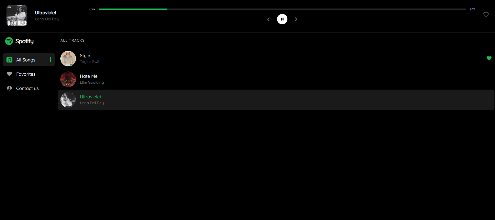
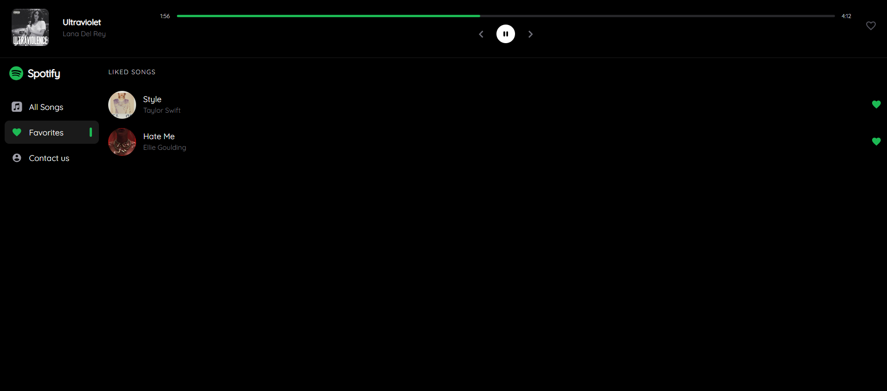
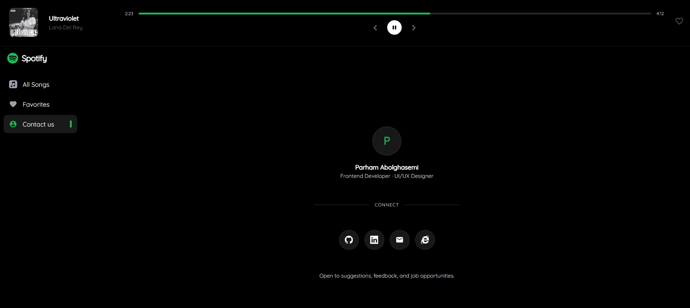

# 🎵 Spotify Clone

> **A fully functional music player clone inspired by Spotify's design, built with modern React tooling**

🎧 Play, pause, skip tracks, manage favorites, and scrub through songs — all wrapped in a clean dark UI. Built with React, Tailwind CSS v4, and Zustand for lightweight global state.

[](https://parham-ab-spotify.netlify.app)





---

## 🚀 Features

React Spotify Clone provides a complete music player experience:

### 🎧 Music Player

Play and pause tracks with a circular control button, album art overlay, and smooth icon transitions.

### ⏱ Progress Scrubber

Seek to any point in a song using a draggable progress bar with live current/total time display.

### ⏭ Track Navigation

Skip to the next or previous song with queue wrapping — the last track loops back to the first.

### ❤️ Favorites

Like and unlike any song. All liked tracks are collected on a dedicated Favorites page.

### 🔔 Toast Notifications

Instant visual feedback via react-hot-toast whenever a song is added or removed from favorites.

### 📱 Responsive Layout

Sidebar collapses gracefully on smaller screens; player controls adapt to mobile viewports.

### 📫 Contact Page

Developer profile page with social links, tooltips, and branded hover states.

---

## 💡 Key Features

✅ **Real-time playback state**  
✅ **Race-condition-safe playback**  
✅ **No stale state**  
✅ **One-click copy**  
✅ **Netlify-ready**  
✅ **Fully dark UI**

---

## 🛠️ Tech Stack

- **React 18** — Modern UI framework with hooks
- **Vite** — Lightning-fast dev server and build tool
- **Tailwind CSS v4** — Utility-first styling via `@tailwindcss/vite`
- **Zustand** — Minimal global state for playback and favorites
- **React Router DOM v6** — Client-side routing
- **React Hot Toast** — Lightweight toast notifications
- **React Icons** — Icon library (Bootstrap, Material, Font Awesome sets)

---

## 📦 Installation

### Prerequisites

- Node.js ≥ 18
- npm or yarn

### Setup

1. **Clone the repository**

   ```bash
   git clone https://github.com/parham-ab/react-spotify-clone.git
   cd react-spotify-clone
   ```

2. **Install dependencies**

   ```bash
   npm install
   ```

3. **Start the development server**

   ```bash
   npm run dev
   ```

   Open [http://localhost:5173](http://localhost:5173) in your browser.

4. **Build for production**

   ```bash
   npm run build
   ```

5. **Preview production build**

   ```bash
   npm run preview
   ```

---

## 🎯 How to Use

1. **Browse** the track list on the Songs page
2. **Click** any song row or album cover to start playback
3. **Control** playback from the header bar — play/pause, previous, next
4. **Scrub** the progress bar to seek within the current track
5. **Like** a song using the heart icon; find all liked songs under Favorites
6. **Navigate** between pages using the sidebar

---

## 📁 Project Structure

```
└── spotify/
    ├── public/
    │   ├── _redirects
    │   └── spotify.png
    └── src/
        ├── assets/
        │   ├── img/
        │   ├── music/
        │   └── styles/
        │       └── index.css
        ├── components/
        │   └── Layout/
        │       ├── index.jsx
        │       ├── Header.jsx
        │       ├── Sidebar.jsx
        │       └── Footer.jsx
        ├── constants/
        │   └── sidebar-data.js
        ├── pages/
        │   ├── contact-us/
        │   │   ├── constants/
        │   │   │   └── links.js
        │   │   └── index.jsx
        │   ├── Favorites.jsx
        │   ├── Song.jsx
        │   └── SongsList.jsx
        ├── providers/
        │   └── AudioProvider.jsx
        ├── routes/
        │   └── index.jsx
        ├── store/
        │   └── spotifyStore.js
        ├── App.jsx
        └── main.jsx
```

---

## 🗂 State Management

Global state is handled by a single **Zustand** store (`src/store/spotifyStore.js`):

- `songData` — array of all tracks with `active`, `isPlaying`, and `isFavorite` flags
- `songTrack` — the raw `<audio>` DOM node registered by `AudioProvider` on mount
- `playHandle(id)` — toggles play/pause for the active song, or loads and plays a new one
- `nextSongHandle / prevSongHandle` — advances or rewinds the queue with wrapping
- `toggleFavorite(id)` — flips `isFavorite` and fires a toast notification
- `getCurrentSong()` — derives the active song live from `songData` (no stale snapshot)

The `<audio>` element lives in `AudioProvider` and is registered via `setSongTrack`, making it available to all store actions without prop-drilling or React context.

---

## 🌐 Deployment

The project is configured for deployment on **Netlify**. The `public/_redirects` file ensures React Router's client-side routing works correctly on page refresh:

```
/*  /index.html  200
```

---

## 🤝 Contributing

Contributions are welcome! Feel free to:

- Report bugs
- Suggest new features or pages
- Improve existing components
- Enhance documentation

---

## 👤 Author

**Parham Abolghasemi** — Frontend Developer · UI/UX Designer

- GitHub: [@parham-ab](https://github.com/parham-ab)
- LinkedIn: [parham-abolghasemi](https://www.linkedin.com/in/parham-abolghasemi/)
- Website: [parham-ab.netlify.app](https://parham-ab.netlify.app/)
- Email: parham.abg1@gmail.com

---

## 📄 License

This project is open source and available under the [MIT License](LICENSE).

---

**Happy Listening! 🎵**
